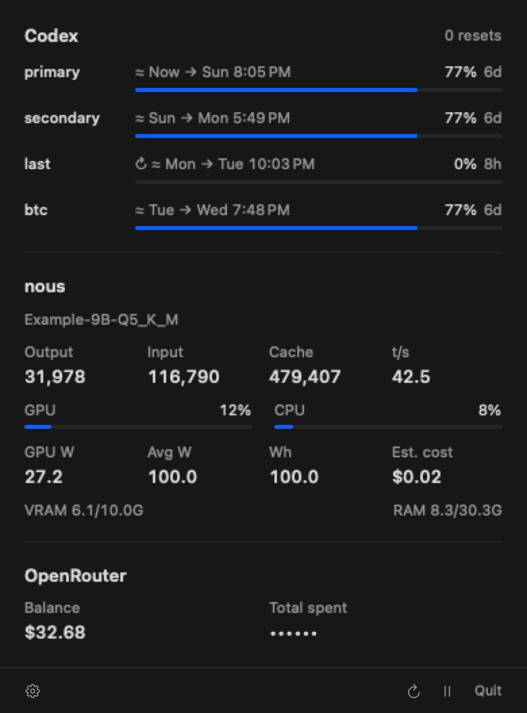

# Usage Bar

Codex, Claude, local inference, and OpenRouter in one quiet macOS menu bar.

<picture>
  
</picture>

**[Download for Apple Silicon](https://github.com/btuckerc/usage-bar/releases/latest)** · **[Download source](https://github.com/btuckerc/usage-bar/archive/refs/heads/main.zip)** · **[Setup](UsageBar/docs/setup.md)** · **[How it works](UsageBar/docs/reference.md)** · **[Contributing](CONTRIBUTING.md)**

- **Frontier:** one ring per Codex and Claude subscription, reset credits, and a pooled Codex forecast that flags quota about to reset unused; and private 7-day/30-day Codex and Claude API-equivalent costs calculated directly from Codex, OMP, and Pi usage.
- **Local inference:** llama-server token counts and speed, plus optional GPU, memory, and energy readings.
- **OpenRouter:** account balance and click-to-reveal lifetime credit spend, kept distinct from estimated API cost.

Built with SwiftUI and AppKit. No third-party runtime dependencies, web views, or analytics. Cloud usage refreshes every five minutes; local cost estimates and host metrics every minute. Sampling slows down in Low Power Mode.

## Install the app

Download the Apple Silicon ZIP from [GitHub Releases](https://github.com/btuckerc/usage-bar/releases/latest), unzip it, and move **Usage Bar.app** to **Applications**. Requires macOS 14 or later.

Release downloads are Developer ID–signed, notarized by Apple, and include a stapled ticket. No local signing or quarantine-removal command is needed; macOS may still ask you to confirm opening a downloaded app. There is no automatic updater; quit the app and replace it with the latest download to update.

## Install from source

Requires **macOS 14 or later** and **Xcode 26.2 or later** with Swift 6.2. Select Xcode as your active developer directory before building.

```sh
git clone https://github.com/btuckerc/usage-bar.git
cd usage-bar
make -C UsageBar install
```

`make -C UsageBar install` quits any running Usage Bar, packages the current source, replaces `/Applications/Usage Bar.app`, and relaunches it. Rerun it after every change so the menu bar never shows an old build. Set `INSTALL_DIR="$HOME/Applications"` to install elsewhere.

Open the menu bar icon, then the gear to set credential paths and your inference host. See [setup](UsageBar/docs/setup.md) for supported account layouts and optional host monitoring.

Source builds are ad-hoc signed. Intel Macs must build from source; the downloadable release is Apple Silicon only.

## Maintainer releases

Usage Bar uses the standalone `UsageBar/` packager, **not** the inherited root `Scripts/release.sh`, CodexBar signing certificate, or Sparkle configuration.

Distribution is through **GitHub Releases, not the Mac App Store**. [Apple Developer ID](https://developer.apple.com/developer-id/) and notarization provide Gatekeeper trust for direct downloads; notarization is not App Store review or listing. This follows the same separation of signing/notarization and GitHub hosting used by [OBS](https://github.com/obsproject/obs-studio/blob/master/.github/workflows/build-project.yaml). Users download the ZIP, extract the app, and move it to Applications—no developer account, signing commands, quarantine removal, or custom installer agreement. Normal macOS download confirmation and requested privacy permissions still apply.

```sh
python3 ../mac-releases/release.py --help
python3 ../mac-releases/release.py build usage-bar \
  --version 0.3.0 --build-number 8 --identity "Developer ID Application: Your Name (TEAMID)"
```

The sibling `mac-releases` checkout provides the shared Apple-toolchain release pipeline for all four apps. One-time setup: create/import a **Developer ID Application** certificate and its private key in macOS Keychain, then run `xcrun notarytool store-credentials mac-releases` interactively. Keep credentials and certificate exports outside Git. Apple Development and ad-hoc identities cannot produce public releases.

The workflow is `build` → `notarize` → `verify` → `draft` → `publish`. Builds require clean committed source and record the commit, architecture, Xcode version, signing team, app version, and build number. Notarization uses Apple's `notarytool`; accepted apps get a stapled ticket and must pass code-signature, deployment-target, Gatekeeper, and extracted-ZIP checks. Checksums and release metadata accompany downloads. A failed or pending notarization produces no finalized release.

Before a draft upload, explicitly create and push the intended `usage-bar-vVERSION` tag at the built commit. This preserves Usage Bar's existing namespace without colliding with inherited CodexBar `vVERSION` tags. Draft/publish require `--confirm btuckerc/usage-bar@usage-bar-vVERSION`; publishing downloads and verifies the draft assets before making them public. The tool never commits, pushes, creates tags, or publishes as a side effect of building. Historical releases and their assets are left unchanged.

For build-only integration, use `python3 UsageBar/scripts/build-release.py --release --identity ... --version X.Y.Z --build-number N --output /absolute/path/UsageBar.app`. Release output must be new and does not replace the development bundle. Both modes generate the app icon from `UsageBar/scripts/make-icon.swift`: the menu-bar Orbit's four arcs, rendered as a static mint mark on a dark teal macOS tile. The menu-bar icon remains live and unchanged.

## A few details

Usage Bar reads existing sign-ins without modifying them. Account names are nicknames, and credentials stay in their original files. Local history powers the estimates; no usage data is sent to the project. Codex/OpenAI token usage is scanned directly from Codex, OMP, and Pi sessions and priced independently. An optional one-time T3 history bootstrap preserves older usage, but ongoing calculation does not require T3. Appended usage is read incrementally and history survives removal of the original logs.

The pooled forecast treats Codex accounts as one parallel pool, as OMP's load balancing uses them, at your average pace over active days in the last 30 days. It includes known resets. It is an estimate, not an account switcher. GPU energy is GPU-only, and local inference counters reset when the model process restarts. [Details and limitations →](UsageBar/docs/reference.md)

## Credit

A focused fork of [CodexBar](https://github.com/steipete/CodexBar) by Peter Steinberger and contributors. The standalone app lives in [`UsageBar/`](UsageBar/); the original source remains alongside it. The preview above is rendered by Usage Bar with synthetic data.

[MIT license](LICENSE).
